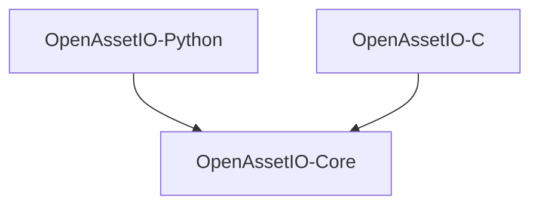

# Python wheel planning

## Agenda

- Overview of project architecture
- Current approach
- Goals
- Proposal for setup.py/CMake refactor

## Project Architecture

- Modular, with several optional components:
  - **openassetio-core**: Core API/auditing/debug functionality. C++
  - **openassetio-c**: C bindings *(optional)*
  - **openassetio-python**: Python bindings *(optional)*
- Testing is majority python, but more and more language specific tests.
- Optional components should be easily disabled/removed.

## Current approach

- CMake is in charge
  - Builds compiled components
  - Creates a venv in `dist`
  - `pip install`s python implementation to venv via `setup.py`
  - Copies in cmodule

- 👎 Challenging for people new to cmake
- 👎 `setup.py` Doesn't know about C++ so `pip instal .` is broken
- 👎 CMake calls `setup.py` to install for testing, so:
  - `setup.py` can't then call CMake.
  - `pip`s want to use the internet makes off-line builds hard.
- 👎 Hard to use with existing venvs or Rez, etc.

## Goals

- PyPi published wheels.
- Intuitive on-boarding for new developers.
- Fast TDD loops.
- Flexible approach that supports non venv workflows.
- Simpler CMake

## Proposal

[Work plan on GitHub](https://github.com/OpenAssetIO/OpenAssetIO/issues/627)

- Build `dist` via CMake `install(...)` instead of `pip install`.
- Execute tests via `PYTHONPATH` extension vs venv.
- Add option to disable auto-install of test deps/etc... to venv.

- 👍 `setup.py` can now call `cmake` to produce valid package complete
  with compiled components, to publish to PyPi
- 👍 Test dependencies can (optionally) be provided by other means.
- 👍 Tests can even be run against alternate environments.
- 👍 CMake is simpler.
- 👍 TDD loop is as fast as it can be short of an editable install.

### Question - `setup.py`

Should `setup.py` do everything?

**Option 1**: `setup.py` calls `cmake` (and `conan install`?)

**Option 2**: `cmake` run manually first, and generates `setup.py`

- Does having `setup.py` know all help with multi-dist builds for PyPi?
